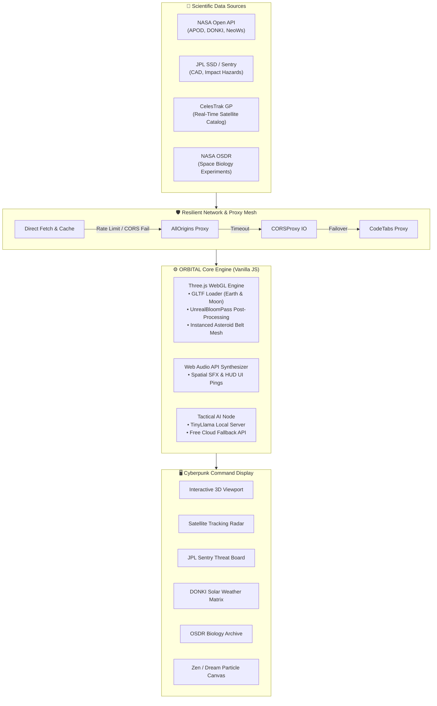
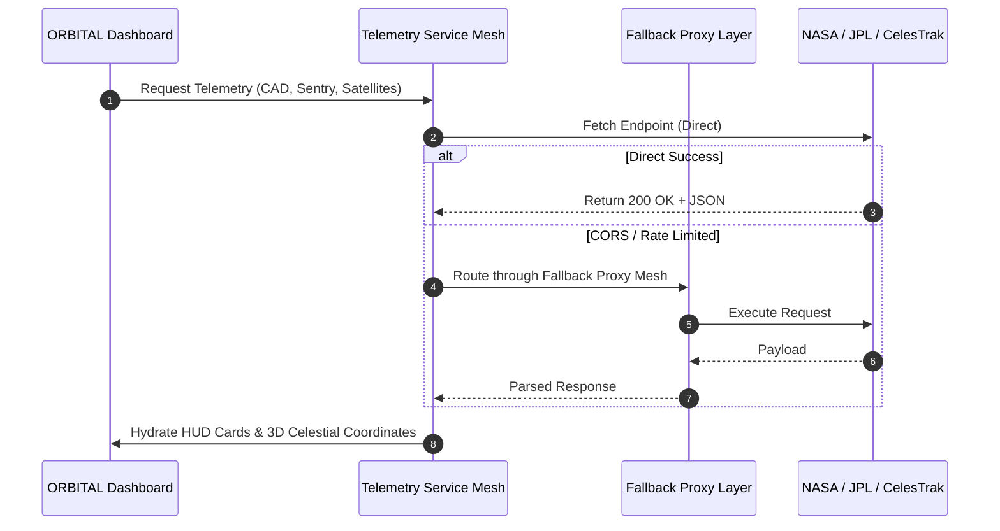

# 🛰️ ORBITAL — Space Telemetry & Central Command Dashboard

[](https://opensource.org/licenses/MIT)
[](https://threejs.org/)
[](https://api.nasa.gov/)
[](https://get.webgl.org/)
[](https://github.com/GuptaNandinii)

> **ORBITAL** is a next-generation, browser-based 3D aerospace telemetry workstation. Built with Three.js, WebGL post-processing shaders, and live scientific pipelines, ORBITAL bridges real-time astrophysics telemetry with an interactive cyberpunk HUD command interface.

---

## 🌌 System Architecture & Data Flow

ORBITAL aggregates raw observational datasets from NASA, JPL, and CelesTrak, routes them through a resilient multi-layer proxy fallback pipeline, and visualizes orbits and hazards directly inside a 60-FPS 3D environment.



---

## ⚡ Key Features

### 1. High-Fidelity 3D Astrophysics Engine
* **Planetary Realism**: Procedurally lit 3D models of Earth and Moon loaded via `GLTFLoader`.
* **Atmospheric Glow & Bloom**: Powered by Three.js `EffectComposer` with custom `UnrealBloomPass` thresholds for cinematic neon radiation.
* **Instanced Debris Field**: Thousands of individual asteroid rocks rendering at a steady 60 FPS using GPU instancing.
* **Dynamic Starfield & Procedural Nebula**: Canvas-generated radial gradient textures producing infinite cosmic depth without heavy asset overhead.

### 2. Live Aerospace Telemetry Streams


* **JPL Close Approach Data (CAD)**: Tracks asteroids and comets approaching within lunar distances.
* **JPL Sentry Impact Risk System**: Displays potential virtual impactors with calculated Palermo and Torino scale risk indices.
* **DONKI Space Weather**: Real-time monitoring of Solar Flares, Coronal Mass Ejections (CMEs), and Geomagnetic Storms.
* **CelesTrak Active Satellite Radar**: Search and monitor thousands of operational satellites (Starlink, GPS, Weather, Scientific payloads) with orbital elements.
* **NASA OSDR Biological Research**: Query open-science aerospace biology datasets directly in an expandable data drawer.

### 3. Integrated Tactical Space AI
* **Dual-Engine Architecture**:
  * **Local Node Mode**: Directly connects to a local embedded AI node (e.g. Raspberry Pi running `llama-server` on port `8080`).
  * **Cloud Fallback Mode**: Instantly switches to cloud AI completions when running standalone or mobile.
* **Space-Trained Persona**: Specialized prompt tuning focusing strictly on astrophysics, orbital calculations, and space mission logs.

### 4. Zen & Dream Relaxation Modes
* Toggle between high-intensity **Tactical Surveillance Mode** and relaxing **Zen Mode** (`Z` key).
* Features floating cosmic stardust, dynamic spline constellations, and calming philosophical quotes to eliminate cognitive fatigue.

---

## 📂 Repository Structure

```text
ORBITAL/
├── index.html                   # Central Command HUD interface & DOM layout
├── main.js                      # Three.js 3D engine, camera animations & AI logic
├── style.css                    # Cyberpunk aesthetic, scanlines & responsive styles
├── package.json                 # Project configuration and scripts
├── EARTH.glb                    # High-resolution Earth mesh
├── MOON.glb                     # Realistic Moon mesh
├── osdr.json                    # Cached NASA OSDR biological datasets
├── services/
│   ├── asteroidApi.js           # JPL CAD, NeoWs & Fireball API handler
│   ├── donkiApi.js              # NASA Space Weather (CME, Flares, Storms)
│   ├── nasaApi.js               # APOD & Mars environmental telemetry
│   ├── researchApi.js           # NASA OSDR search & modal loader
│   └── satelliteApi.js          # CelesTrak satellite catalog query engine
├── vercel.json                  # Vercel security headers and clean URL config
└── ORBITAL_project_report.txt   # Scientific and architectural documentation
```

---

## 🚀 Quick Start

### Prerequisites
* A modern web browser with **WebGL 2.0** support (Chrome, Edge, Firefox, Brave, Safari).
* [Node.js](https://nodejs.org/) (optional, for local development server).

### Installation & Run

1. **Clone the repository**:
   ```bash
   git clone https://github.com/GuptaNandinii/ORBITAL.git
   cd ORBITAL
   ```

2. **Launch a local server**:
   Using `npx` (zero install needed):
   ```bash
   npx serve .
   ```
   *Or using Python*:
   ```bash
   python -m http.server 8080
   ```

3. **Open the Dashboard**:
   Navigate to `http://localhost:8080` in your web browser.

---

## ⌨️ Tactical Controls & HUD Shortcuts

| Key / Control | Function |
| :--- | :--- |
| **Left Click + Drag** | Orbit around celestial bodies in 3D space |
| **Scroll Wheel** | Camera zoom in / zoom out |
| **Right Click + Drag** | Pan 3D coordinate camera |
| **`Z`** | Toggle Zen / Dream Mode |
| **`ESC`** | Dismiss telemetry modals & AI assistant overlays |
| **HUD Nav Sidebar** | Direct jump to Sector Telemetry, Satellite Radar & Sentry Hazards |

---

## 📡 Data Providers & Attribution

All telemetry visualized in **ORBITAL** is sourced from open scientific repositories:
* **[NASA Open APIs](https://api.nasa.gov/)** — Astronomy Picture of the Day, NeoWs, and DONKI.
* **[NASA JPL Center for NEO Studies (CNEOS)](https://cneos.jpl.nasa.gov/)** — Sentry System & CAD API.
* **[CelesTrak](https://celestrak.org/)** — General Perturbations (GP) Satellite Element Sets.
* **[NASA Open Science Data Repository (OSDR)](https://osdr.nasa.gov/)** — Biological Spaceflight Research.

---

## 👩‍💻 Author & Maintainer

Developed by **[Nandini Gupta](https://github.com/GuptaNandinii)**

* **GitHub**: [@GuptaNandinii](https://github.com/GuptaNandinii)
* **Project Repository**: [GuptaNandinii/ORBITAL](https://github.com/GuptaNandinii/ORBITAL)

---

## 📄 License

This project is open-source and released under the [MIT License](LICENSE).
